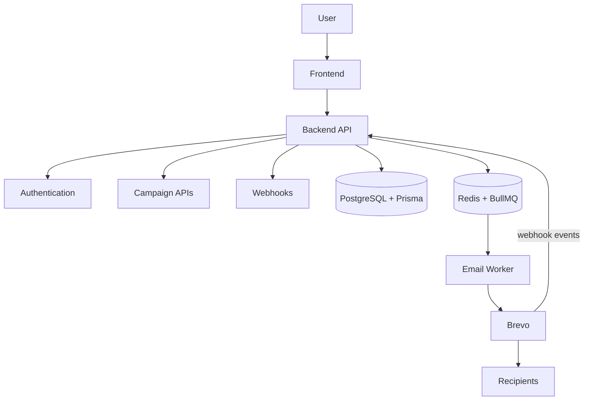

# Email Campaign Manager

A full-stack platform for creating, validating, sending, tracking, and reconciling bulk email campaigns. A React (TanStack Start) frontend and Express API authenticate users via Google OAuth, persist data in PostgreSQL through Prisma, and process all email delivery asynchronously with Redis + BullMQ and the Brevo Transactional Email API.

## Overview

Sending bulk email by hand is error-prone: lists contain invalid addresses, synchronous sends block the API, providers rate-limit bursts, and crashes can leave campaigns stuck in flight. This application solves those problems with a complete pipeline — recipient validation before sending, durable queued delivery, throttled background workers, retries with backoff, per-recipient delivery tracking, provider webhooks, and periodic reconciliation of stuck campaigns.

## Features

- Google OAuth 2.0 authentication with session-based access control
- Campaign creation with sender, subject, body, recipients, and attachments
- Recipient parsing, de-duplication, syntax validation, and MX/DNS verification
- Background email processing via Redis + BullMQ (never in the request path)
- Batch email sending, worker rate limiting, and retries with exponential backoff
- Per-recipient delivery tracking with Redis markers and counters
- Brevo Transactional API integration with SMTP/Nodemailer fallback
- Webhook processing of Brevo delivery events (delivered, bounced, blocked, spam, deferred)
- Periodic reconciliation of stuck `SENDING` campaigns
- Security hardening: OAuth state, sanitized logs, CORS allow-list, rate limiting, environment validation, graceful shutdown

## Tech Stack

| Layer | Technology |
|---|---|
| Frontend | React 19, TanStack Start, TanStack Router, TanStack Query, TypeScript, Tailwind CSS 4, Radix UI, Vite |
| Backend | Express 5, Node.js (CommonJS, run via tsx) |
| Database | PostgreSQL |
| ORM | Prisma 7 (`@prisma/client`, `@prisma/adapter-pg`, `pg`) |
| Queue | BullMQ + ioredis |
| Cache/Session | Redis (queue store, delivery markers/counters, sessions) |
| Email Provider | Brevo Transactional API (Nodemailer SMTP fallback) |
| Authentication | Passport + passport-google-oauth20, express-session |

## Architecture



The backend serves the API and runs the BullMQ worker and reconciliation in a single process. Campaigns are persisted, queued, and delivered by the worker, while Brevo webhooks report per-recipient delivery outcomes back into the system.

## How It Works

1. User signs in with Google (OAuth state-protected, session created).
2. User creates a campaign with recipients and optional attachments.
3. Recipients are parsed, de-duplicated, syntax-checked, and verified against MX/DNS records.
4. Delivery jobs are queued to Redis/BullMQ — never sent in the request.
5. The worker processes jobs with concurrency 5 and a 20 jobs/sec rate limit.
6. Emails are sent through Brevo (batched) or SMTP, with 3 attempts and exponential backoff.
7. Brevo webhooks report delivery events; Redis markers/counters drive campaign finalization.
8. Reconciliation audits stale `SENDING` campaigns and finalizes them based on evidence.

## Project Structure

```text
├── prisma/schema.prisma       # Models: User, Campaign, Recipient, Attachment, CampaignHistory
├── src/                       # Express API backend
│   ├── app.js / server.js     # App assembly, startup, graceful shutdown
│   ├── config/                # Passport, Prisma, Redis, session, Brevo, env validation
│   ├── middleware/            # requireAuth, rate limiting, async error forwarding
│   ├── queues/ workers/       # BullMQ queue and email worker
│   ├── routes/                # /auth, /campaigns, /dashboard, /webhooks
│   ├── services/              # Brevo scheduling, webhook processing, reconciliation
│   └── utils/                 # Email/MX validation, log sanitizer, recipient parser
└── frontend/                  # TanStack Start app (sign-in, dashboard, create, history)
```

## Local Setup

Prerequisites: Node.js ≥ 18, PostgreSQL, Redis (local or Docker), and a Google OAuth app.

```sh
git clone git@github.com:tponviji1005-oss/email-campaign-manager.git
cd email-campaign-manager

npm install              # backend + Prisma
cd frontend && npm install && cd ..

cp .env.example .env     # fill in DATABASE_URL, Google OAuth, SESSION_SECRET, Redis, Brevo
docker run -d --name email-campaign-redis -p 6379:6379 redis:7   # or local Redis

npm run prisma:generate  # generated client is gitignored
npx prisma db push       # sync schema to a fresh database

npm run dev              # backend on http://localhost:3000 (also runs worker + reconciliation)
cd frontend && npm run dev   # frontend on http://localhost:5173
```

## Environment Variables

Copy `.env.example` to `.env` and fill in real values. Never commit `.env`.

| Variable | Purpose |
|---|---|
| `DATABASE_URL` | PostgreSQL connection string |
| `GOOGLE_CLIENT_ID` / `GOOGLE_CLIENT_SECRET` | Google OAuth credentials |
| `GOOGLE_CALLBACK_URL` | OAuth redirect URI (HTTPS in production) |
| `SESSION_SECRET` | Session cookie secret (≥ 32 chars) |
| `REDIS_HOST` / `REDIS_PORT` / `REDIS_PASSWORD` | Redis connection |
| `FRONTEND_URL` / `CORS_ORIGIN` | Allowed frontend origins (no `*`) |
| `BREVO_API_KEY` / `BREVO_SENDER_EMAIL` / `BREVO_SENDER_NAME` | Brevo provider config |
| `BREVO_WEBHOOK_TOKEN` | Shared secret for `/webhooks/brevo` |
| `EMAIL_PROVIDER` | `brevo` or `gmail`/`smtp` |
| `VITE_API_BASE_URL` (frontend) | Backend API origin |

## Security & Reliability

- OAuth state protection with session regeneration to prevent login CSRF/fixation
- Secure session cookies (`httpOnly`, `secure` in production) with a dedicated Redis store
- CORS origin allow-list (`*` rejected) with pre-flight origin checks
- Helmet security headers
- In-memory rate limiting on auth, campaign, parsing, and webhook endpoints
- Fail-fast environment validation at startup
- Timing-safe webhook authentication via a shared secret
- Sanitized logs and error responses (no emails, credentials, or stacks)
- Bounded retries (3 attempts, exponential backoff) and delivery markers to prevent duplicate sends
- Graceful shutdown of HTTP, worker, queue, SMTP, Prisma, and Redis
- Evidence-based reconciliation of stuck campaigns with Redis locks

## Testing

The repository contains no automated test suite. The following checks were performed manually during development against the live application (real PostgreSQL, Redis, Google OAuth, and email provider):

- OAuth state validation (missing/mismatched/reused state rejected)
- SMTP environment validation
- Redis/session isolation under failure
- Reliability checks: retry/backoff, duplicate-send prevention, finalization
- Graceful shutdown suite
- Prisma schema validation (`npx prisma validate`)
- Backend syntax checks (`node --check`)
- Frontend TypeScript check (`npx tsc --noEmit`)
- Frontend production build (`npm run build`)
- End-to-end real email smoke test (campaign delivered and finalized `SENT`)

## Production Deployment

Hosting, domain, DNS, and provider configuration are deployment-specific. A production deploy requires:

- Production PostgreSQL and Redis instances
- Production environment variables (`NODE_ENV=production`, real secrets, explicit origins)
- `npx prisma generate` and `npx prisma migrate deploy` (create the initial migration first — none are committed)
- Google OAuth production callback URL registered (HTTPS required)
- HTTPS/TLS termination behind a reverse proxy
- Brevo sender/domain verified and SPF/DKIM/DMARC DNS records published
- Frontend built (`npm run build`) and deployed separately

## Email Deliverability

Successful API delivery does not guarantee inbox placement. Production should use a verified sending domain with SPF, DKIM, and DMARC records, maintain a good sender reputation, and follow responsible sending practices — validating lists, controlling volume, and avoiding spammy content.

## Future Improvements

Not currently implemented:

- Campaign scheduling
- Richer analytics
- Email templates
- Unsubscribe management
- Advanced recipient segmentation

## License

ISC.

## Final Notes

The application is production-ready from the application-code side: authentication, queueing, delivery, webhooks, reconciliation, and graceful shutdown are all implemented and verified. Production infrastructure, domain, DNS, secrets, and provider configuration must still be completed during deployment.
